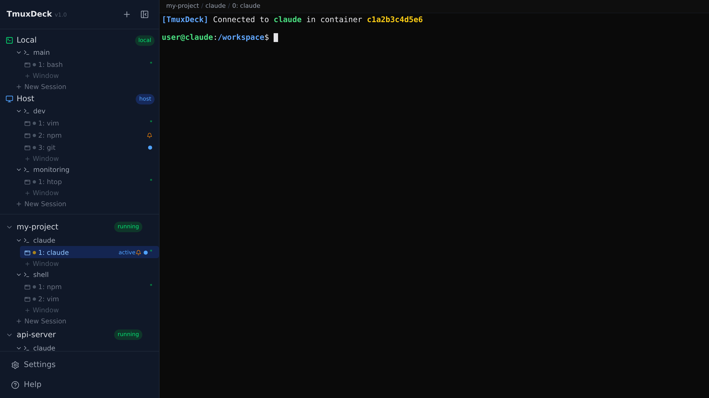

<p align="center">
  <strong>TmuxDeck</strong><br>
  A web dashboard for managing tmux sessions across Docker containers
</p>

<p align="center">
  <a href="#quick-start">Quick Start</a> &bull;
  <a href="#features">Features</a> &bull;
  <a href="#keyboard-shortcuts">Shortcuts</a> &bull;
  <a href="#configuration">Configuration</a> &bull;
  <a href="#bridge-setup">Bridges</a> &bull;
  <a href="#cli">CLI</a> &bull;
  <a href="#contributing">Contributing</a>
</p>

---

Run AI coding agents, dev servers, and long-lived processes inside Docker containers. TmuxDeck gives you a single browser tab to manage all of them — create containers from templates, organize tmux sessions and windows, and interact through a real terminal powered by xterm.js.



## Why TmuxDeck?

If you run multiple Docker containers with tmux sessions inside them — for AI agents, development environments, build systems — you know the pain of `docker exec`-ing into each one and juggling terminal tabs. TmuxDeck replaces that workflow:

- **One browser tab** instead of a dozen terminal windows
- **Instant switching** between sessions with a connection pool (no reconnect delay)
- **Fuzzy search** across all containers, sessions, and windows (Ctrl+K)
- **Drag-and-drop** to reorder sessions and move windows between them
- **Create containers from Dockerfile templates** with one click
- **Host tmux too** — manage sessions on the host machine, not just containers
- **Remote bridges** — manage tmux on remote machines via a lightweight WebSocket agent
- **Nix packaging** — run as a native service via Home Manager (no Docker required)
- **CLI tool** — list sessions, capture text, take screenshots from the command line

## Quick Start

### Docker Compose (recommended)

```bash
git clone https://github.com/msbrogli/tmuxdeck.git
cd tmuxdeck
docker compose up -d
```

Open **http://localhost:3000**. The backend API runs on port 8000.

To also manage **host tmux sessions**, pass your UID:

```bash
HOST_UID=$(id -u) docker compose up -d
```

To listen on all interfaces (e.g. for access from other machines):

```bash
BIND_HOST=0.0.0.0 docker compose up -d
```

### Local Development

```bash
# Backend (Python 3.12 + uv)
cd backend
uv sync
DATA_DIR=./data TEMPLATES_DIR=../docker/templates \
  uv run uvicorn app.main:app --reload --host 0.0.0.0 --port 8000

# Frontend (in another terminal)
cd frontend
npm install
npm run dev
```

Open **http://localhost:5173** — Vite proxies `/api/*` and `/ws/*` to the backend automatically.

### Nix / Home Manager

Install directly with Nix:

```bash
nix profile install github:msbrogli/tmuxdeck
tmuxdeck  # starts on http://127.0.0.1:8000
```

Or enable as a Home Manager service:

```nix
{
  services.tmuxdeck = {
    enable = true;
    port = 8000;
    host = "127.0.0.1";
    dataDir = "~/.local/share/tmuxdeck";
    dockerSocket = "/var/run/docker.sock";
    environmentFile = ./secrets/tmuxdeck.env;  # optional, for TELEGRAM_BOT_TOKEN etc.
  };
}
```

On Linux this creates a systemd user service; on macOS a launchd agent. Both restart on failure automatically.

### Mock Mode (no backend needed)

Want to explore the UI without Docker or a running backend?

```bash
cd frontend
npm install
VITE_USE_MOCK=true npm run dev
```

This runs the full UI with simulated containers, sessions, and a mock terminal.

## Features

### Real Terminal in the Browser

Full xterm.js terminal with ANSI color support, clickable links, and native tmux keybindings — Ctrl-B works as expected. Copy with Ctrl+Shift+C, paste with Ctrl+Shift+V (Cmd+C/V on Mac). Paste or drag-and-drop images directly into the terminal.

### Terminal Connection Pool

TmuxDeck keeps up to 8 WebSocket connections alive in the background (configurable 1-32) with LRU eviction. Switching between sessions is instant — no reconnect, no redraw delay.

### Session Switcher (Ctrl+K)

Fuzzy search across every container, session, and window. Results are ranked by recency and match quality. Hover to preview, Enter to switch.

### Drag-and-Drop Organization

- Drag windows within a session to reorder (`tmux swap-window`)
- Drag windows onto another session to move them (`tmux move-window`)
- Drag session headers to reorder within a container (persisted in localStorage)

### Quick-Switch Digits

Assign Ctrl+1 through Ctrl+0 to any window. Digits follow their windows when you reorder. Ctrl+Alt+1-0 to assign or unassign.

### Container Lifecycle

Create containers from Dockerfile templates with real-time build log streaming. Start, stop, rename, or remove from the sidebar context menu. Double-click any name to rename inline.

### Dockerfile Template Editor

Create and edit Dockerfile templates with Monaco editor syntax highlighting. Each template can define default environment variables and volume mounts. Ships with two templates:

- **claude-worker** — Node 20 + Claude Code CLI, ready for AI agent workflows
- **basic-dev** — Ubuntu 24.04 + build tools for general development

### Host & Local Tmux

Not just Docker — TmuxDeck can manage tmux sessions on the host machine and on the machine running the backend. The special container IDs `host` and `local` appear in the sidebar alongside your Docker containers.

### Remote Bridges

Manage tmux sessions on remote machines via a lightweight agent (`tmuxdeck-bridge`) that connects back over a single WebSocket. The bridge multiplexes JSON control frames and binary terminal I/O on one connection. It supports local, host-socket, and Docker discovery on the remote side and auto-reconnects with exponential backoff. See [Bridge Setup](#bridge-setup) for details.

### Configurable Keyboard Shortcuts

All hotkeys are user-configurable from Settings. Click any binding to record a new key combination. Changes are persisted to `settings.json` and take effect immediately.

### Container Fold/Unfold

Collapse containers in the sidebar with Ctrl+Left/Right. Folded containers show a preview overlay listing sessions with status indicators (idle, busy, waiting, attention). Use arrow keys to navigate the preview and Enter to select a session.

### Telegram Session Management

Telegram bot commands for remote session interaction:

- `/list` — browse sessions with inline keyboard navigation and status emoji
- `/screenshot <session>` — receive a PNG screenshot of a session pane
- `/capture <session>` — receive pane text content
- `/talk <session>` — enter talk mode, sending keystrokes from Telegram to the terminal
- `/cancel` — exit talk mode

Reply to any notification or screenshot message to send text directly to that session.

### CLI Tool

`tmuxdeck list`, `tmuxdeck capture`, and `tmuxdeck screenshot` provide command-line access to session data. ANSI-to-PNG rendering uses pyte + Pillow. See [CLI](#cli) for usage.

### Cloud Relays

Connect your TmuxDeck instance to a cloud relay for remote access without port forwarding. Relays tunnel HTTP and WebSocket traffic through a persistent outbound connection. Configure via Settings > Relays or environment variables.

### Voice Agent

OpenAI-powered voice interaction via Telegram. Send a voice message to transcribe and process it through a chat agent, with optional text-to-speech responses. Requires `OPENAI_API_KEY`.

### File Viewer

View files from inside containers directly in the browser. Supported formats include code (with syntax highlighting), CSV, PDF, images, logs, and Markdown.

### IP Allowlist

Optional IP-based access control supporting Tailscale ranges and localhost. Enable with `IP_ALLOWLIST_ENABLED=true` for zero-config security on Tailscale networks.

### Debug Log

In-memory ring buffer (2000 entries) merging backend and frontend logs. Viewable in Settings > Log tab with level/source filtering and auto-refresh. Frontend logs are prefixed with `ui:`.

### Notification Channels

Notifications support a `channels` field (`web`, `os`, `telegram`) for delivery routing. If `telegram` is enabled but `web` is not, the message is sent to Telegram immediately; otherwise Telegram acts as a fallback after a configurable timeout. Deduplication prevents notification floods for the same container/session/window.

### Silent Activity Monitoring

Tmux `monitor-activity` is auto-enabled with `activity-action none`, powering sidebar activity indicators without audible bells.

### PIN Authentication

Optional PIN-based authentication protects the dashboard. No user management overhead — set a PIN in Settings and sessions last 7 days.

### Mouse Mode Detection

When tmux mouse mode is enabled (which breaks browser text selection), TmuxDeck shows a warning banner with a one-click button to disable it.

## Keyboard Shortcuts

| Shortcut | Action |
|---|---|
| `Ctrl+K` | Open session switcher (fuzzy search) |
| `Ctrl+H` | Show keyboard shortcuts |
| `Ctrl+1` - `Ctrl+0` | Jump to assigned window |
| `Ctrl+Alt+1` - `Ctrl+Alt+0` | Assign/unassign digit to current window |
| `Ctrl+Up` / `Ctrl+Down` | Previous / next window |
| `Ctrl+Left` / `Ctrl+Right` | Fold / unfold container |
| `Shift+Ctrl+Up` / `Shift+Ctrl+Down` | Move window up / down |
| `Esc` `Esc` | Deselect current session |

All shortcuts are configurable in Settings. All tmux keybindings (Ctrl-B + w, Ctrl-B + c, etc.) pass through natively.

## Configuration

### Environment Variables

| Variable | Default | Description |
|---|---|---|
| `DATA_DIR` | `/data` | Directory for settings and template data (JSON files). Defaults to `~/.local/share/tmuxdeck` when running via Nix. |
| `DOCKER_SOCKET` | `/var/run/docker.sock` | Docker socket path |
| `CONTAINER_NAME_PREFIX` | `tmuxdeck` | Prefix for managed container names |
| `TEMPLATES_DIR` | `/app/docker/templates` | Path to seed Dockerfile templates |
| `HOST_TMUX_SOCKET` | *(none)* | Host tmux socket for host session access |
| `STATIC_DIR` | *(none)* | Path to frontend static files (used by Nix package) |
| `TELEGRAM_BOT_TOKEN` | *(none)* | Telegram bot token for text interaction |
| `TELEGRAM_ALLOWED_USERS` | *(none)* | Comma-separated Telegram user IDs |
| `RELAY_URL` | *(none)* | Cloud relay WebSocket URL (e.g. `wss://relay.tmuxdeck.io/ws/tunnel`) |
| `RELAY_TOKEN` | *(none)* | Relay authentication token |
| `OPENAI_API_KEY` | *(none)* | OpenAI API key for voice agent |
| `CHAT_AGENT_MODEL` | `gpt-4o` | OpenAI chat model for voice agent |
| `TTS_MODEL` | `tts-1` | Text-to-speech model |
| `TTS_VOICE` | `alloy` | TTS voice option |
| `IP_ALLOWLIST_ENABLED` | `false` | Enable IP allowlist (Tailscale + localhost) |
| `IP_ALLOWLIST` | `127.0.0.0/8,::1,100.64.0.0/10` | Allowed IP ranges when allowlist is enabled |

### Settings (via UI)

- **Default volume mounts** — pre-fill when creating containers (e.g. `~/.claude:/root/.claude`)
- **SSH key path** — auto-mount SSH keys into containers for private repo access
- **Terminal pool size** — how many background connections to keep alive (1-32)
- **Telegram bot** — token and allowed users for text-based session interaction
- **Telegram chats** — manage registered Telegram chats (list, remove)
- **Keyboard shortcuts** — customize all hotkeys from the UI
- **Bridges** — create and manage bridge connections to remote machines
- **Relays** — configure cloud relay tunnels for remote access
- **Debug log** — view merged backend + frontend debug log with filtering

## Architecture

```
Browser (React + xterm.js)
    |
    |--- REST /api/v1/* ---> FastAPI backend
    |--- WS   /ws/*     ---> WebSocket terminal handler
                                |
                                |--- docker-py ---> Docker Engine
                                |--- docker exec ---> tmux inside containers
                                |--- tmux (local) ---> host/local sessions
                                |
                                |--- WS /ws/bridge <--- tmuxdeck-bridge agent(s)
                                                            |
                                                            |--- tmux (local)
                                                            |--- tmux (host socket)
                                                            |--- docker exec ---> remote containers
```

### Tech Stack

| Layer | Technology |
|---|---|
| Backend | Python 3.12, FastAPI, docker-py |
| Frontend | React 19, TypeScript, Vite 7, Tailwind CSS 4 |
| Terminal | xterm.js (fit + web-links addons) |
| Template editor | Monaco Editor |
| Data fetching | TanStack Query |
| Package managers | uv (backend), npm (frontend) |
| Deployment | Docker Compose, nginx, Nix |

### Project Structure

```
tmuxdeck/
├── backend/                # Python 3.12 + FastAPI
│   ├── app/
│   │   ├── api/            # REST endpoints
│   │   │   ├── auth.py
│   │   │   ├── bridges.py
│   │   │   ├── containers.py
│   │   │   ├── debug_log.py
│   │   │   ├── files.py
│   │   │   ├── images.py
│   │   │   ├── notifications.py
│   │   │   ├── ordering.py
│   │   │   ├── sessions.py
│   │   │   ├── settings.py
│   │   │   └── templates.py
│   │   ├── ws/             # WebSocket handlers
│   │   │   ├── terminal.py
│   │   │   └── bridge.py
│   │   ├── services/       # Business logic
│   │   │   ├── audio.py
│   │   │   ├── bridge_manager.py
│   │   │   ├── debug_log.py
│   │   │   ├── docker_manager.py
│   │   │   ├── notification_manager.py
│   │   │   ├── relay_client.py
│   │   │   ├── relay_manager.py
│   │   │   ├── render.py
│   │   │   ├── telegram_bot.py
│   │   │   ├── tmux_manager.py
│   │   │   └── voice_agent.py
│   │   ├── schemas/        # Pydantic request/response models
│   │   ├── cli.py          # CLI tool (tmuxdeck list/capture/screenshot)
│   │   ├── middleware.py   # Auth & IP allowlist middleware
│   │   └── config.py
│   ├── tests/              # pytest test suite
│   └── pyproject.toml      # Dependencies (managed with uv)
│
├── bridge/                 # Standalone bridge agent
│   ├── tmuxdeck_bridge/
│   │   ├── __main__.py
│   │   ├── bridge.py
│   │   ├── config.py
│   │   └── terminal.py
│   └── pyproject.toml
│
├── frontend/               # React 19 + TypeScript + Vite
│   └── src/
│       ├── components/     # Sidebar, Terminal, SessionSwitcher, FoldedContainerPreview, ...
│       ├── hooks/          # Terminal pool, keyboard shortcuts, useContainerExpandedState
│       ├── pages/          # MainPage, TemplatesPage, SettingsPage, BridgeSettingsPage, DebugLogPage
│       ├── utils/          # hotkeys, debugLog
│       ├── mocks/          # Mock API for development without backend
│       └── api/            # API client
│
├── nix/
│   └── hm-module.nix      # Home Manager module (systemd + launchd)
├── scripts/                # Shell helpers (tmuxdeck-notify, tmuxdeck-install-hooks, ...)
├── docker/
│   └── templates/          # Bundled Dockerfile templates
├── flake.nix               # Nix flake (packages + HM module)
├── docker-compose.yml
└── .env.example
```

## API

### Health

| Method | Path | Description |
|---|---|---|
| GET | `/health` | Health check endpoint |

### Containers

| Method | Path | Description |
|---|---|---|
| GET | `/api/v1/containers` | List all containers (Docker + host + local + bridge) |
| POST | `/api/v1/containers` | Create container from template |
| POST | `/api/v1/containers/stream` | Create container with streaming build log |
| GET | `/api/v1/containers/{id}` | Get container details |
| PATCH | `/api/v1/containers/{id}` | Rename container |
| DELETE | `/api/v1/containers/{id}` | Remove container |
| POST | `/api/v1/containers/{id}/start` | Start container |
| POST | `/api/v1/containers/{id}/stop` | Stop container |

### Sessions & Windows

| Method | Path | Description |
|---|---|---|
| GET | `/api/v1/containers/{id}/sessions` | List tmux sessions |
| POST | `/api/v1/containers/{id}/sessions` | Create session |
| PATCH | `/api/v1/containers/{id}/sessions/{sid}` | Rename session |
| DELETE | `/api/v1/containers/{id}/sessions/{sid}` | Kill session |
| POST | `.../sessions/{sid}/windows` | Create window |
| POST | `.../sessions/{sid}/swap-windows` | Swap two windows |
| POST | `.../sessions/{sid}/move-window` | Move window to another session |
| POST | `.../sessions/{sid}/clear-status` | Clear all window statuses in session |
| POST | `.../sessions/{sid}/windows/{idx}/clear-status` | Clear single window status |

### Bridges

| Method | Path | Description |
|---|---|---|
| GET | `/api/v1/bridges` | List configured bridges |
| POST | `/api/v1/bridges` | Create bridge (returns token) |
| PATCH | `/api/v1/bridges/{id}` | Enable/disable bridge |
| DELETE | `/api/v1/bridges/{id}` | Delete bridge |

### Notifications

| Method | Path | Description |
|---|---|---|
| POST | `/api/v1/notifications` | Create notification |
| POST | `/api/v1/notifications/dismiss` | Dismiss notification |
| GET | `/api/v1/notifications` | List pending notifications |
| GET | `/api/v1/notifications/stream` | SSE notification stream |

### Files & Images

| Method | Path | Description |
|---|---|---|
| GET | `/api/v1/containers/{id}/file` | Retrieve a file from a container |
| POST | `/api/v1/containers/{id}/upload-image` | Upload an image to a container (max 20 MB) |

### Ordering

| Method | Path | Description |
|---|---|---|
| GET | `/api/v1/ordering/containers` | Get container display order |
| PUT | `/api/v1/ordering/containers` | Set container display order |
| GET | `/api/v1/ordering/containers/{id}/sessions` | Get session display order |
| PUT | `/api/v1/ordering/containers/{id}/sessions` | Set session display order |

### Relays

| Method | Path | Description |
|---|---|---|
| GET | `/api/v1/settings/relays` | List cloud relays |
| POST | `/api/v1/settings/relays` | Create relay |
| PATCH | `/api/v1/settings/relays/{id}` | Update relay |
| DELETE | `/api/v1/settings/relays/{id}` | Delete relay |

### Debug Log

| Method | Path | Description |
|---|---|---|
| GET | `/api/v1/debug-log` | Get debug log entries |
| DELETE | `/api/v1/debug-log` | Clear debug log |

### Telegram Chats

| Method | Path | Description |
|---|---|---|
| GET | `/api/v1/settings/telegram-chats` | List registered chats |
| DELETE | `/api/v1/settings/telegram-chats/{id}` | Unregister a chat |

### Terminal (WebSocket)

Connect to `WS /ws/terminal/{container_id}/{session_name}/{window_index}` for an interactive terminal. Control messages: `RESIZE:cols:rows`, `SCROLL:up:N`, `SCROLL:down:N`, `SELECT_WINDOW:index`, `DISABLE_MOUSE:`.

For bridge-sourced sessions, terminal traffic is proxied over the bridge WebSocket (`/ws/bridge`) rather than direct container exec.

### Templates & Settings

| Method | Path | Description |
|---|---|---|
| GET/POST | `/api/v1/templates` | List / create templates |
| GET/PUT/DELETE | `/api/v1/templates/{id}` | Read / update / delete template |
| GET/POST | `/api/v1/settings` | Get / update settings |

## Bridge Setup

Remote bridges let you manage tmux sessions on machines that aren't running TmuxDeck directly. A lightweight agent (`tmuxdeck-bridge`) connects back to the TmuxDeck backend over a single WebSocket.

### 1. Create a bridge in Settings

Open Settings > Bridges and click **Add Bridge**. Give it a name and copy the generated token — it is shown only once.

### 2. Run the bridge agent

```bash
# Install
cd bridge
uv sync

# Run
tmuxdeck-bridge --url ws://your-server:8000/ws/bridge --token <TOKEN> --name my-remote
```

The agent discovers local tmux sessions by default. To also discover sessions via a host socket or Docker containers:

```bash
tmuxdeck-bridge \
  --url ws://your-server:8000/ws/bridge \
  --token <TOKEN> \
  --host-tmux-socket /tmp/tmux-host/default \
  --docker-socket /var/run/docker.sock
```

### 3. Docker Compose deployment

```yaml
services:
  bridge:
    build: ./bridge
    environment:
      BRIDGE_URL: ws://tmuxdeck-server:8000/ws/bridge
      BRIDGE_TOKEN: <TOKEN>
      BRIDGE_NAME: my-remote
    restart: unless-stopped
```

> **Docker Desktop note (macOS/Windows):** The `--host-tmux-socket` option requires direct Unix socket access and does not work inside Docker Desktop containers, where sockets are separated by a VM boundary. The bridge detects this and disables the host source automatically. Run the bridge natively (`uv run tmuxdeck-bridge ...`) to manage host tmux sessions on Docker Desktop. Docker socket discovery (`--docker-socket`) works normally.

### CLI flags and environment variables

| Flag | Env Var | Default | Description |
|---|---|---|---|
| `--url` | `BRIDGE_URL` | *(required)* | Backend WebSocket URL |
| `--token` | `BRIDGE_TOKEN` | *(required)* | Authentication token |
| `--name` | `BRIDGE_NAME` | hostname | Display name |
| `--no-local` | — | false | Disable local tmux discovery |
| `--host-tmux-socket` | `HOST_TMUX_SOCKET` | *(none)* | Host tmux socket path |
| `--docker-socket` | `DOCKER_SOCKET` | *(none)* | Docker socket for container discovery |
| `--docker-label` | `DOCKER_LABEL` | *(none)* | Docker container label filter |
| `--report-interval` | — | `5.0` | Session report interval (seconds) |
| `-6` / `--ipv6` | — | false | Use IPv6 |

The agent auto-reconnects with exponential backoff (5s min, 60s max).

## CLI

The `tmuxdeck` CLI provides command-line access to session data.

```bash
cd backend
uv sync
```

### List sessions

```bash
tmuxdeck list                        # all sessions
tmuxdeck list --filter attention     # only sessions needing attention
tmuxdeck list --filter running       # only busy sessions
tmuxdeck list --filter idle          # only idle sessions
```

### Capture pane text

```bash
tmuxdeck capture <session_id>                  # print to stdout
tmuxdeck capture <session_id> -o output.txt    # save to file
tmuxdeck capture <session_id> -w 2             # specific window
tmuxdeck capture <session_id> --ansi           # include ANSI escape sequences
```

### Screenshot pane

```bash
tmuxdeck screenshot <session_id>                  # saves screenshot.png
tmuxdeck screenshot <session_id> -o my-shot.png   # custom output path
tmuxdeck screenshot <session_id> -w 1             # specific window
```

Screenshots are rendered from ANSI text using pyte + Pillow.

## Contributing

### Running Tests

```bash
# Backend
cd backend
uv run pytest

# Frontend
cd frontend
npm test
```

### Linting

```bash
# Backend
cd backend
uv run ruff check app
uv run ruff format --check app

# Frontend
cd frontend
npm run lint
```

### Building for Production

```bash
docker compose up --build
```

## License

MIT
