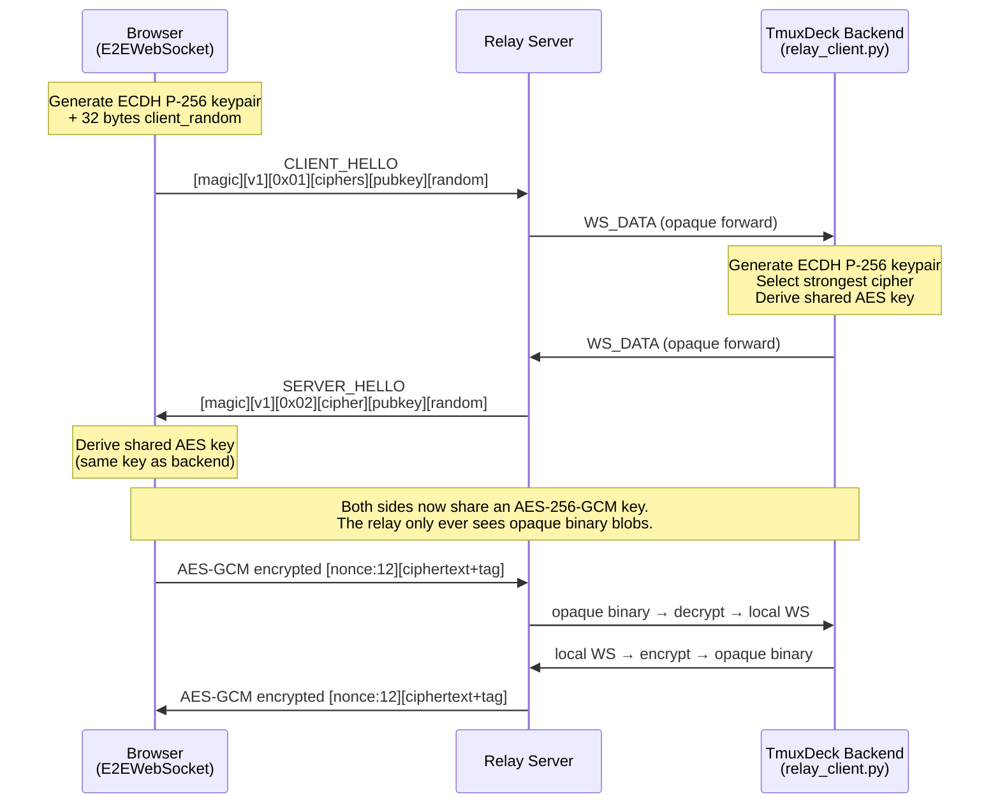
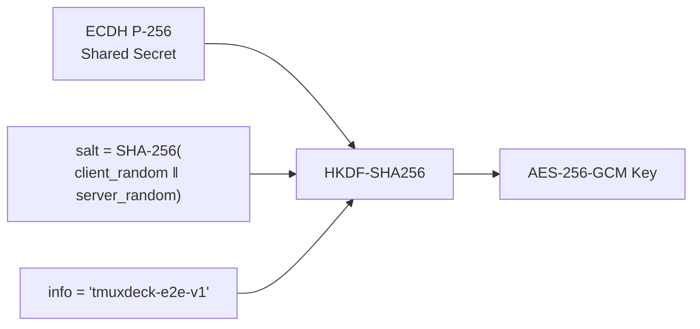
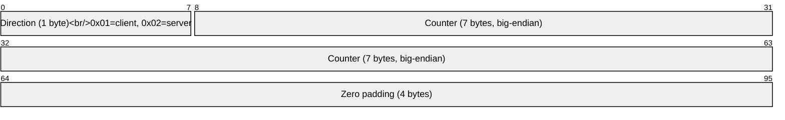
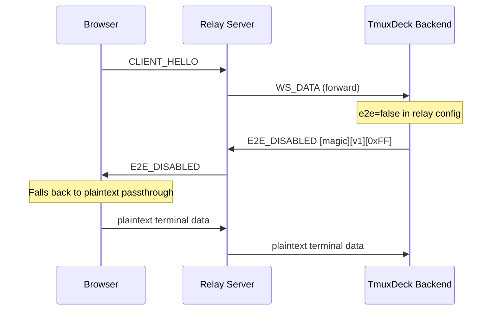

# E2E Encryption for Relay Connections

When accessing TmuxDeck through a [cloud relay](../cloud-relay/), terminal data (keystrokes, screen output) passes through the relay server. E2E encryption ensures this data is encrypted between the browser and the TmuxDeck backend — the relay server never sees plaintext.

## Overview

The E2E encryption uses **ECDH P-256 key exchange** and **AES-256-GCM authenticated encryption**, implemented entirely using the [Web Crypto API](https://developer.mozilla.org/en-US/docs/Web/API/Web_Crypto_API) (browser) and Python's [`cryptography`](https://cryptography.io/) library (backend). The relay requires **zero changes** — encrypted messages travel as normal WebSocket data through the existing tunnel.

E2E is enabled by default for all relay connections and can be toggled per-relay in Settings → Relays.

## Protocol Flow

## Handshake

### CLIENT_HELLO

The browser generates an ephemeral ECDH P-256 keypair and sends:

| Field | Size | Description |
|-------|------|-------------|
| Magic | 4 bytes | `0x00 0xE2 0xEE 0x00` — identifies handshake messages |
| Version | 1 byte | Protocol version (`1`) |
| Type | 1 byte | `0x01` = CLIENT_HELLO |
| Cipher count | 1 byte | Number of supported ciphers |
| Ciphers | N bytes | `0x01` = AES-256-GCM, `0x02` = AES-128-GCM |
| Pubkey length | 2 bytes | Big-endian length of public key |
| Public key | 65 bytes | ECDH P-256 uncompressed point |
| Client random | 32 bytes | `crypto.getRandomValues()` |

### SERVER_HELLO

The backend relay client generates its own ECDH keypair and responds:

| Field | Size | Description |
|-------|------|-------------|
| Magic | 4 bytes | `0x00 0xE2 0xEE 0x00` |
| Version | 1 byte | `1` |
| Type | 1 byte | `0x02` = SERVER_HELLO |
| Selected cipher | 1 byte | Strongest mutually supported cipher |
| Pubkey length | 2 bytes | Big-endian length of public key |
| Public key | 65 bytes | ECDH P-256 uncompressed point |
| Server random | 32 bytes | `os.urandom()` |

## Key Derivation

Both sides independently:

1. Perform ECDH to get a 256-bit shared secret
2. Compute `salt = SHA-256(client_random || server_random)` for transcript binding
3. Derive the AES key via `HKDF-SHA256(shared_secret, salt, info="tmuxdeck-e2e-v1")`

## Encrypted Messages

After the handshake, all messages use AES-GCM:

| Field | Size | Description |
|-------|------|-------------|
| Nonce | 12 bytes | `[direction:1][counter:7][zero:4]` |
| Ciphertext + GCM tag | variable | Encrypted payload with authentication tag |

### Nonce Structure

- **Direction byte** prevents nonce reuse between client and server
- **Counter** increments per message per direction
- The nonce is included in the frame so decryption doesn't require synchronized counters

## Security Properties

| Property | How it's achieved |
|----------|-------------------|
| **Confidentiality** | AES-256-GCM encryption — relay sees only opaque binary |
| **Integrity** | GCM authentication tag detects any tampering |
| **Forward secrecy** | Ephemeral ECDH keys per connection — past sessions can't be decrypted |
| **Replay protection** | Transcript binding via `SHA-256(client_random \|\| server_random)` in HKDF salt |
| **Cipher agility** | Client proposes ciphers, server selects strongest mutual option |
| **No relay trust** | Relay forwards encrypted blobs without any ability to inspect or modify |

## Disabling E2E

Each relay has an E2E toggle in Settings → Relays. When disabled:

The browser's `E2EWebSocket` wrapper detects the `E2E_DISABLED` response (type `0xFF`) and switches to plaintext passthrough mode — `send()` and incoming messages go directly through the raw WebSocket without encryption.

## Debug HUD

Enable the debug overlay in Settings → General → Debug to monitor:

- **Connection status**: CONN (green) / DISC (red)
- **Latency**: Color-coded round-trip PING/PONG time
- **E2E status**: Cipher name (`AES-256-GCM`), `none` when disabled, `NO E2E` for direct connections
- **Message counts**: Encrypted tx/rx counters

## Implementation

| File | Role |
|------|------|
| [`frontend/src/utils/e2eCrypto.ts`](../frontend/src/utils/e2eCrypto.ts) | `E2EWebSocket` — drop-in WebSocket wrapper with transparent encrypt/decrypt |
| [`backend/app/services/e2e_crypto.py`](../backend/app/services/e2e_crypto.py) | Server-side ECDH handshake + AES-GCM `E2ESession` |
| [`backend/app/services/relay_client.py`](../backend/app/services/relay_client.py) | Intercepts handshake in relay proxy, encrypts/decrypts tunnel traffic |
| [`frontend/src/components/DebugHud.tsx`](../frontend/src/components/DebugHud.tsx) | Debug overlay with latency and E2E status |
| [`docs/p2p-encryption-design.md`](./p2p-encryption-design.md) | Original design document with options analysis and benchmarks |
